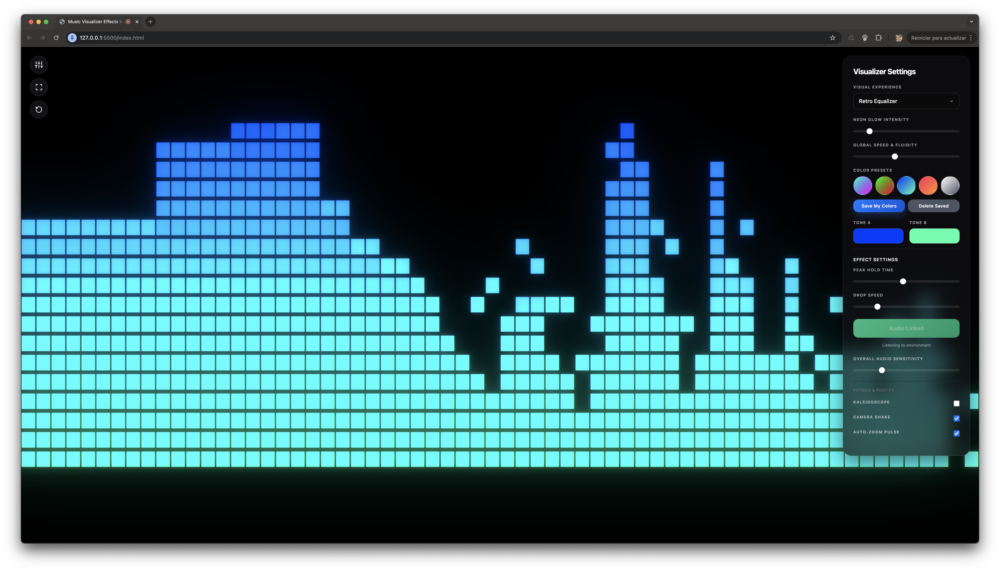

# 🌌 Premium Music Visualization Effects

A high-performance, immersive music visualization platform built with **Three.js** and **GLSL Shaders**. This project offers a state-of-the-art sensory experience that reacts in real-time to environmental audio with cinematic quality.

## ✨ New in Version 2.0 (Evolution Update)

We've recently upgraded the engine to provide a more visceral and physical experience:
- **🌋 Dynamic Background System**: A massive 5,000-point Starfield and animated Nebulae that pulse with the bass and mids of your music.
- **🎬 Pro FX Suite**: Integrated `EffectComposer` with custom shaders for **Rhythmic Glitch**, **Chromatic Aberration**, and **Impact Flashes**.
- **💥 Camera Physics**: The camera now feels the music with **Beat Shake** (vibration on heavy hits) and **Auto-Zoom Pulse** for deep immersion.
- **💠 Kaleidoscope Mode**: Transform any pattern into a hypnotic radial symmetry experience with a single click.
- **💡 Impact Lighting**: Dynamic `PointLights` that orbit and blink, creating real 3D depth and shadows.
- **📱 PWA & Native Experience**: Installable as an app on iOS and Android with a standalone full-screen interface (no browser bars).
- **🔋 Stay Awake Logic**: Uses the Screen Wake Lock API to prevent the device from sleeping during the visualization.

---

## 🎭 11 Immersive Visual Patterns

- `Energy Waves`: Flowing 3D lines reacting to frequencies.
- `Neural Network`: Dynamic nodes and connections with reactive pulses.
- `Retro Equalizer`: Classic logarithmic bar visualization.
- `Oscilloscope`: Real-time spectrum wave.
- `Floating Orbs`: Particle-based movement and dispersion.
- `Spinning Galaxy`: Spiral formation of star points.
- `DNA Helixes`: Moving double helix structures.
- `Starfield Warp`: Traveling through space with audio-driven speed.
- `Infinite Tunnel`: Pulsating 3D ring tunnel.
- `Nebula Clouds`: Soft, atmospheric particle fields.
- `Connected Particles`: Network-style particle interaction.

---

## 📸 Gallery Showcase

  
  
  
  

---

## 🛠️ Technology Stack

- **Graphics Engine**: [Three.js](https://threejs.org/) (R128)
- **Shaders**: Custom GLSL (DigitalFX, Kaleidoscope)
- **Post-Processing**: UnrealBloomPass & EffectComposer
- **Audio Intelligence**: Web Audio API (Mic-linking with beat detection)
- **Styling**: Tailwind CSS (Premium Glassmorphism)
- **Tutorial System**: Custom Step-by-Step Spotlight Onboarding
- **PWA Architecture**: Manifest.json + Service Worker (Offline-ready)

---

## 🌟 Premium UI/UX Features

- **Intuitive Onboarding**: A modern tutorial highlights the main features for first-time visitors.
- **Professional Layout**: Optimized desktop design with settings on the right to accommodate utility controls on the left.
- **Color Customization**: Dual-tone color mapping with premium presets (**Aurora, Matrix, Ocean, Sunset, Silver**).
- **Persistence**: Your custom color presets and tutorial state are saved automatically in `LocalStorage`.
- **Responsive Architecture**: Fully optimized for mobile, tablet, and desktop viewing.

---

## 🚀 Getting Started

1. Clone or download this repository.
2. Open `index.html` directly in your browser.
   - *Note: For best performance, it is recommended to run a local server (e.g., Live Server or `npx serve .`).*
3. Click **"Link Environment Audio"** and allow microphone access to start the experience.

## 📄 License

This project is open-source and created for artistic and educational purposes. Feel free to use and evolve it for your own creative visions.
